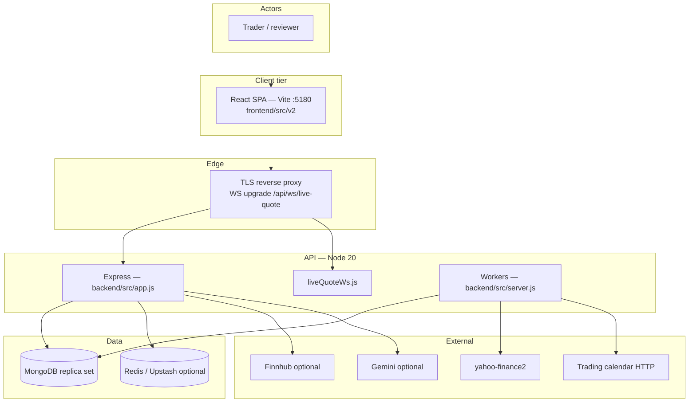
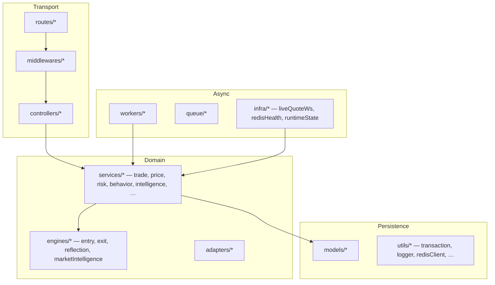
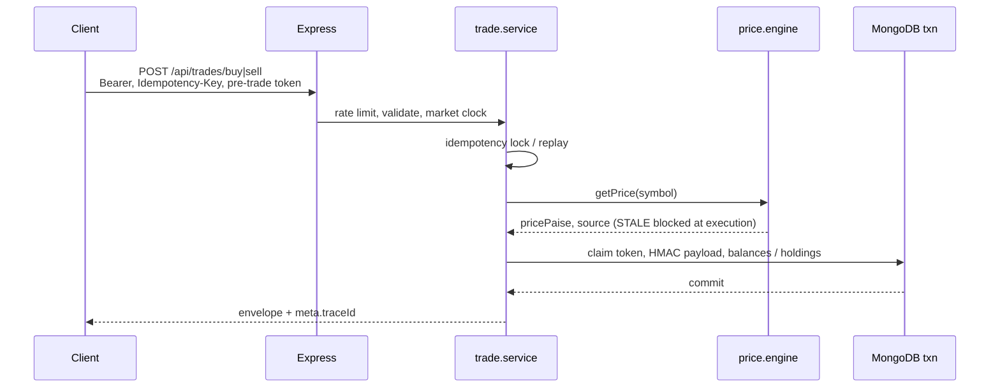

# NOESIS

**Behavior-aware paper trading for Indian equity markets (NSE-oriented).**

[](https://github.com/shreyash-sj10/Noesis/actions)


-2ea44f)


> **CI badge:** points at public repo [`shreyash-sj10/Noesis`](https://github.com/shreyash-sj10/Noesis). Update the workflow URL if your canonical remote differs.

| | |
|---|---|
| [Quick start](#quick-start) | [Configuration](#configuration) |
| [What it does](#what-it-does) | [Architecture](#architecture) |
| [Core flows](#core-flows) | [API reference](#api-reference) |
| [Local development](#local-development) | [Testing & CI](#testing--ci) |
| [Deployment](#deployment) | [Operations](#operations) |
| [Repository map](#repository-map) | [Documentation index](#documentation-index) |

---

## Quick start

**Goal:** SPA on **5180**, API on **5001**, both talking to the same origin.

```bash
# From repo root
npm run install:all

# Backend
cd backend
cp .env.example .env
# Edit: MONGO_URI (replica set), JWT_SECRET (32+ chars), FRONTEND_URL=http://localhost:5180
# Keep PORT=5001 unless you change the frontend env too (see below).
npm run dev

# Frontend (new terminal)
cd frontend
cp .env.example .env
# Must match backend port — default in .env.example:
#   VITE_API_BASE_URL=http://localhost:5001
npm run dev
```

Open **http://localhost:5180**. Register or log in.

| Symptom | Likely cause |
|--------|----------------|
| Login shows **“Unable to authenticate”** + `ERR_CONNECTION_REFUSED` on `:5001` | API not running, or **`PORT` ≠ `VITE_API_BASE_URL`** (e.g. backend on `5000`, UI still calling `5001`). |
| CORS errors | `FRONTEND_URL` must include the exact SPA origin (`http://localhost:5180`). |
| Trades fail on calendar | Optional `TRADING_CALENDAR_URL` Docker service down — see [India market runbook](docs/INDIA_MARKET_RUNBOOK.md) and `npm run seed:calendar` in `backend/`. |

Before production deploy: **`npm run verify:env`** (repo root or `backend/`).

---

## What it does

NOESIS is a **full-stack paper trading simulator** for Indian cash equities (**delivery** and **intraday buy-only**). It does **not** connect to a live broker.

| Tier | Role |
|------|------|
| **`backend/`** | Express REST under `/api/*`, MongoDB (transactions on a **replica set**), in-process workers (outbox, stop/target monitor, square-off, calendar sync, order sweeper, execution executor). Optional **Redis / BullMQ** for cache, rate limits, and queues — **trade correctness does not require Redis**. |
| **`frontend/`** | React 19 + Vite 7 SPA (`frontend/src/v2/`): home terminal, markets scanner, portfolio, journal, profile, trace, weekly discipline report, trade decision overlay. |

**Live quotes:** authenticated WebSocket  
`ws(s)://<api-host>/api/ws/live-quote?token=<access_jwt>`  
(`backend/src/infra/liveQuoteWs.js`) — same `getPrice()` path as `GET /api/market/quote`. HTTP remains authoritative for mutations. **Load balancers must allow WebSocket upgrade** on that path.

**Disclaimer:** Paper simulation only. Not investment advice. Not affiliated with NSE, BSE, or any broker. Execution **fails closed** when quotes are untrusted (`STALE`, drift checks, `MARKET_DATA_UNAVAILABLE`).

---

## Architecture

### System context



### Code layers (API process)



### Trade execution (simplified)



**Scale constraint:** background loops run **in-process** on each API instance. Run **one** web replica until work is externalized — see [`backend/docs/BACKGROUND_WORKERS_SCALE.md`](backend/docs/BACKGROUND_WORKERS_SCALE.md).

---

## Core flows

### Pre-trade intelligence

1. `POST /api/intelligence/pre-trade` — Zod-validated plan (`validatePreTradePayload`).
2. `preTradeGuard.service.js` loads news/sentiment, behavioral flags, closed-trade history; runs **`evaluateEntryDecision`** (`engines/entry.engine.js`) with **`risk.engine`** checks.
3. **`issueDecisionToken`** (`preTradeAuthority.store.js`) stores UUID + **`payloadHash = HMAC-SHA256(JWT_SECRET, canonical JSON)`** over `symbol`, `productType`, `pricePaise`, `quantity`, `stopLossPaise`, `targetPricePaise`. TTL: **`PRE_TRADE_TOKEN_TTL_MS`** (clamped 60s–15m, default 10m).
4. Gemini **`explainDecision`** runs **async** — token issuance does not wait on AI.

**Implementation nuance:** both `evaluateEntryDecision` calls in `preTradeGuard.service.js` pass a `plan` **without** `productType`, so composite weights default to **delivery-style** scoring. The **HMAC still binds `productType` from the request**, so execution cannot change product class without invalidating the token.

### Trade execution

- **`POST /api/trades/buy`** / **`POST /api/trades/sell`**: `protect` → per-user rate limit (Redis store when available) → **`idempotency-key` required** → `validateTradePayload` → pre-trade token (`pre-trade-token` header or body) → `checkMarketClock` → `trade.service`.
- **Idempotency:** `ExecutionLock` + `requestPayloadHash`; replay returns stored response; body mismatch → `PAYLOAD_MISMATCH`.
- **Price:** `services/price.engine.js` — Redis → memory → Yahoo → stale memory; **`STALE` rejected** for execution.
- **Money:** integer **paise** at boundaries; display rounding in adapters/UI.

### Post-trade

- Outbox worker (`OUTBOX_POLL_MS`, default 5s) processes `TRADE_CLOSED` and related events (`workers/outbox.worker.js`).
- **`reflection.engine.js`** maps exits to learning outcomes (`DISCIPLINED_PROFIT`, `DISCIPLINED_LOSS`, `POOR_PROCESS`, `LUCKY_PROFIT`, `NEUTRAL`, …).

---

## Configuration

### Ports and URLs (local)

| Component | Default | Source |
|-----------|---------|--------|
| Frontend dev server | **5180** | `frontend/vite.config.js` (`strictPort: true`) |
| Backend HTTP | **5001** in `.env.example`; code fallback **`8080`** if `PORT` unset | `backend/.env.example`, `backend/src/server.js` |
| Frontend → API | **`http://localhost:5001`** → resolved to `…/api` | `frontend/.env.example`, `frontend/src/v2/api/api.js` (`resolveApiBaseUrl`) |
| CORS | `FRONTEND_URL` + optional `FRONTEND_URLS`; dev fallback includes 5173–5180 | `backend/src/app.js` |

Use **`VITE_API_BASE_URL_LOCAL`** when you need localhost-only override without changing production `VITE_API_BASE_URL`.

### Required environment (real runs)

| Variable | Where | Purpose |
|----------|--------|---------|
| `MONGO_URI` | backend | Replica-set MongoDB (Atlas M0+ or local `rs.initiate()`) |
| `JWT_SECRET` | backend | Access/refresh signing + pre-trade HMAC (32+ chars) |
| `FRONTEND_URL` | backend | Primary CORS origin (HTTPS in prod) |
| `VITE_API_BASE_URL` or `VITE_API_URL` | frontend build | Public API origin (with or without `/api` suffix) |

See **`backend/.env.example`** and **`frontend/.env.example`** for Redis, calendar, Finnhub, Gemini, rate limits, square-off IST time, and safety flags (`ALLOW_CLOSED_MARKET_EXECUTION`, `SKIP_CSRF_DEV` blocked in production by `scripts/verify-env.js`).

---

## API reference

JSON routes are under **`/api`** unless noted. Root probes (no `/api` prefix): **`GET /health`**, **`GET /ready`**, **`GET /metrics`**.

### Auth & users

| Method | Path | Auth |
|--------|------|------|
| POST | `/api/auth/register` | — |
| POST | `/api/auth/login` | — |
| POST | `/api/auth/refresh` | HttpOnly refresh cookie + **`X-CSRF-Token`** |
| POST | `/api/auth/logout` | Bearer |
| GET | `/api/users/me` | Bearer |
| GET | `/api/users/profile` | Bearer |

### Intelligence & pre-trade

| Method | Path | Auth |
|--------|------|------|
| POST | `/api/intelligence/pre-trade` | Bearer |
| POST | `/api/intelligence/judge-trade` | Bearer |
| GET | `/api/intelligence/news` | Bearer |
| GET | `/api/intelligence/portfolio` | Bearer |
| GET | `/api/intelligence/global` | Bearer |
| GET | `/api/intelligence/timeline` | Bearer |
| GET | `/api/intelligence/profile` | Bearer |

### Trades & portfolio

| Method | Path | Auth |
|--------|------|------|
| POST | `/api/trades/buy` | Bearer + trade limits + idempotency + pre-trade |
| POST | `/api/trades/sell` | Bearer + trade limits + idempotency + pre-trade |
| GET | `/api/trades` | Bearer |
| GET | `/api/trades/execution-status/:tradeId` | Bearer |
| GET | `/api/portfolio/summary` | Bearer |
| GET | `/api/portfolio/positions` | Bearer |

### Market data (read-mostly)

| Method | Path | Auth |
|--------|------|------|
| GET | `/api/market/session` | Rate limit |
| GET | `/api/market/quote?symbol=` | Rate limit |
| GET | `/api/market/indices` | Rate limit |
| GET | `/api/market/overview` | Rate limit |
| GET | `/api/market/validate` | Rate limit |
| GET | `/api/market/history` | Rate limit |
| GET | `/api/market/fundamentals` | Rate limit |
| GET | `/api/market/explore` | Rate limit |
| GET | `/api/market/news` | Bearer + rate limit |
| GET | `/api/market/news/portfolio` | Bearer + rate limit |

**WebSocket:** `GET` upgrade on `/api/ws/live-quote` — JWT query param; Origin must match CORS allowlist.

### Journal, analysis, metrics, trace

| Method | Path | Auth |
|--------|------|------|
| GET | `/api/journal/summary` | Bearer |
| GET | `/api/analysis/summary` | Bearer |
| GET | `/api/metrics/skill-progress` | Bearer |
| GET | `/api/metrics/behavior` | Bearer |
| GET | `/api/metrics/outcomes` | Bearer |
| GET | `/api/trace` | Bearer |
| GET | `/api/trace/:trace_id` | Bearer |

### Health & observability

| Method | Path | Notes |
|--------|------|--------|
| GET | `/health`, `/api/health` | Liveness |
| GET | `/ready`, `/api/health/ready` | Readiness (Mongo + worker flags; 503 when core down) |
| GET | `/metrics`, `/api/observability/metrics` | Request counters (no Prometheus exporter in-tree) |
| GET | `/api/observability/jobs/summary` | Outbox depth |
| GET | `/api/observability/traces/:traceId` | Buffered trace events (restricted in production unless `ENABLE_TRACE_BUFFER=true`) |

---

## Local development

### Prerequisites

- **Node.js 20+**
- **MongoDB replica set** (Atlas or local `rs.initiate()`)
- **Redis** — optional (`USE_REDIS=false` for degraded mode)
- **Trading calendar** (optional Docker) — see `backend/.env.example` and [docs/INDIA_MARKET_RUNBOOK.md](docs/INDIA_MARKET_RUNBOOK.md)

### Useful scripts

```bash
# Repo root
npm run install:all
npm run build          # frontend production bundle
npm run start          # backend only (node src/server.js)
npm run verify:env

# Backend (cd backend)
npm run dev
npm test
npm run test:unit | test:integration | test:security | test:concurrency
npm run seed:calendar
npm run seed:portfolio
npm run db:clear       # destructive — dev only

# Frontend (cd frontend)
npm run dev
npm run test:unit
npm run build
npm run lint
```

---

## Testing & CI

| Suite | Command | Notes |
|-------|---------|--------|
| Backend (Jest) | `cd backend && npm test` | **48** suites, **201** tests; in-memory Mongo **replica set** by default (`tests/setup/jest-env-mongo.js`). Set `USE_EXTERNAL_MONGO=true` to hit `MONGO_URI` from `.env`. |
| Backend subsets | `npm run test:unit`, `test:integration`, `test:security`, `test:concurrency` | See `backend/package.json` |
| Frontend (Vitest) | `cd frontend && npm run test:unit` | e.g. `marketSessionLabels.test.ts` |
| Frontend build | `cd frontend && npm run build` | Required in CI |

**GitHub Actions** (`.github/workflows/ci.yml`): Node 20; backend tests with MongoDB 6 service + `REQUIRE_DB_TESTS=1`; frontend Vitest + Vite production build.

---

## Deployment

- **Blueprint:** [`render.yaml`](render.yaml) — web service, `rootDir: backend`, `healthCheckPath: /health`. Set **`MONGO_URI`**, **`JWT_SECRET`**, **`FRONTEND_URL`** (HTTPS SPA origin). Align frontend **`VITE_API_BASE_URL`** / **`VITE_API_URL`** with the public API URL.
- **Single instance:** keep **one** API replica until background work is coordinated ([`backend/docs/BACKGROUND_WORKERS_SCALE.md`](backend/docs/BACKGROUND_WORKERS_SCALE.md)).
- **WebSockets:** enable sticky upgrade or terminate WS on the same API tier.
- **Static SPA:** deploy `frontend/dist/`; cookie `SameSite` / CORS must match (`AUTH_COOKIE_SAMESITE` in backend — see `.env.example`).

---

## Operations

| Signal | Endpoint / location |
|--------|---------------------|
| Structured logs | Winston JSON (`service`, `step`, `status`, `traceId`) |
| HTTP access | Morgan → Winston |
| Request metrics | `GET /metrics`, `GET /api/observability/metrics` |
| Readiness | `GET /ready`, `GET /api/health/ready` |
| Load tests | `scripts/k6/` (run only against environments you control) |

| Risk | Mitigation in code |
|------|---------------------|
| Horizontal scale | One API instance or externalize workers / distributed locks |
| Market data | Yahoo + optional Finnhub; not licensed NSE feed; throttling + cache tiers |
| Automation latency | Stop/target monitor is polling-based (`stopLossMonitor.service.js`) |
| AI on critical path | Never blocks pre-trade token issuance |

---

## Tech stack

| Layer | Choices |
|-------|---------|
| SPA | React 19, Vite 7, TanStack Query, Tailwind 4, React Router 6 |
| API | Express 4, Node 20, Zod validation, JWT + HttpOnly refresh + CSRF on refresh |
| Data | Mongoose, MongoDB transactions |
| Cache / queue | `ioredis`, `@upstash/redis`, BullMQ (optional) |
| Market prices | `yahoo-finance2`, `p-queue` throttle (`price.engine.js`) |
| Realtime | `ws` (`liveQuoteWs.js`) |
| Tests | Jest + supertest + mongodb-memory-server ReplicaSet; Vitest (frontend) |

**License:** ISC (`backend/package.json`). Add a root `LICENSE` file if you want GitHub’s license picker to display standard text.

---

## Repository map

```
backend/
  src/app.js, server.js       # HTTP app, bootstrap, WebSocket attach
  src/routes/                 # Route modules (mounted in app.js)
  src/controllers/, middlewares/, adapters/
  src/engines/                # entry, exit, reflection, marketIntelligence
  src/services/               # trade, price, intelligence, monitors, …
  src/workers/, queue/, infra/, models/, utils/
  scripts/                    # verify-env, seeds, migrations
  tests/                      # Jest suites
  docs/BACKGROUND_WORKERS_SCALE.md
frontend/
  src/v2/                     # Primary SPA (pages, features, api, hooks)
  vite.config.js              # dev port 5180
docs/                         # Architecture, India market, portfolio, trade contract
scripts/k6/                   # Optional load scripts
render.yaml                   # Example Render web service
package.json                  # install:all, build, start, verify:env
```

---

## Documentation index

| Document | Purpose |
|----------|---------|
| [backend/docs/BACKGROUND_WORKERS_SCALE.md](backend/docs/BACKGROUND_WORKERS_SCALE.md) | Single-instance vs horizontal scale |
| [docs/INDIA_MARKET_RUNBOOK.md](docs/INDIA_MARKET_RUNBOOK.md) | NSE session, calendar Docker, IST square-off |
| [docs/PORTFOLIO.md](docs/PORTFOLIO.md) | Portfolio API and capital semantics |
| [docs/TRADE_CONTRACT_v1.md](docs/TRADE_CONTRACT_v1.md) | Trade payload / response contract |
| [docs/SYSTEM_DESIGN.md](docs/SYSTEM_DESIGN.md) | System design notes |
| [backend/.env.example](backend/.env.example) | Backend environment reference |
| [frontend/.env.example](frontend/.env.example) | Frontend environment reference |
| [backend/tests/README.md](backend/tests/README.md) | How backend tests use Mongo |

---

## Contributing

1. Open an issue for large design changes.
2. Branch → PR with what / why / risk.
3. **Quality bar:** `cd backend && npm test`, `cd frontend && npm run test:unit && npm run build`, `npm run verify:env` before production-related config changes.
4. Never commit secrets (`.env`, API keys).

---

## Getting help

- **Issues:** [github.com/shreyash-sj10/Noesis/issues](https://github.com/shreyash-sj10/Noesis/issues)
- **Security:** report sensitive findings privately to the maintainer.

---

## Maintainers

| | |
|--|--|
| **Primary** | [@shreyash-sj10](https://github.com/shreyash-sj10) (Shreyash Jadhav) |
| **Contributors** | PRs welcome; review is maintainer-led today. |
