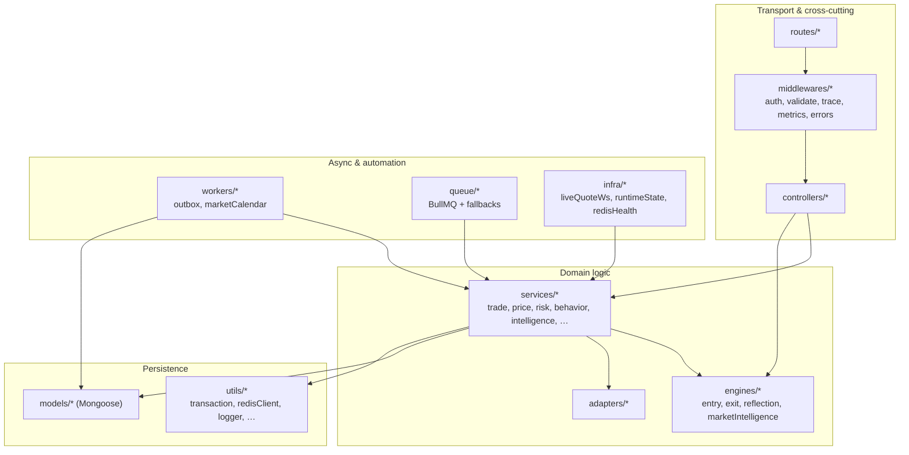
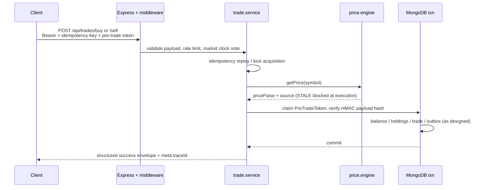

# NOESIS

**Behavior-aware paper trading for Indian equity markets (NSE-oriented).**

[](https://github.com/shreyash-sj10/Noesis/actions)


> **CI badge:** targets public repo **`shreyash-sj10/Noesis`**. If your canonical GitHub remote differs, edit the `github.com/.../workflows/ci.yml` URL so the badge matches your fork.

| Section | |
|--------|---|
| [What this project does](#what-this-project-does) | [Why it is useful](#why-it-is-useful) |
| [Architecture](#architecture) | [Core flows](#core-flows) |
| [Tech stack](#tech-stack) | [Security & compliance posture](#security--compliance-posture) |
| [Observability](#observability) | [API surface](#api-surface) |
| [Local development](#local-development) | [Testing & CI](#testing--ci) |
| [Deployment](#deployment) | [Limitations & operational constraints](#limitations--operational-constraints) |
| [Repository layout](#repository-layout) | [Contributing](#contributing) |
| [Getting help](#getting-help) | [Maintainers](#maintainers) |

---

## What this project does

NOESIS is a **full-stack paper trading simulator** for Indian cash equities with **delivery** and **intraday (buy-only)** flows. It does **not** connect to a live broker.

The backend (`backend/`) exposes a **REST API** under `/api/*`, persists state in **MongoDB** (transactions on a **replica set**), and runs **in-process background workers** (outbox, stop/target monitor, square-off scheduler, calendar sync, sweeper, execution executor). Optional **Redis / BullMQ** improve caching, rate limits, and queues; **core trade correctness does not depend on Redis being available.**

The frontend (`frontend/`) is a **React 19 + Vite 7** SPA using **TanStack Query** and a dedicated **`v2`** shell (`frontend/src/v2/`): markets, portfolio, journal, trade terminal, profile, and analytics surfaces.

**Live quotes (Phase A):** authenticated **WebSocket** on `ws(s)://<api-host>/api/ws/live-quote?token=<access_jwt>` pushes quote ticks using the same `getPrice()` path as `GET /api/market/quote?symbol=`; HTTP remains authoritative for mutations and initial hydration. **Load balancers must support WebSocket upgrades** on that path.

---

## Why it is useful

| Gap in typical “paper” apps | NOESIS approach |
|----------------------------|-----------------|
| Only stores fills | Captures **pre-trade** context, engine snapshot, and **post-trade reflection** |
| PnL-only feedback | Separates **process vs outcome** (e.g. `DISCIPLINED_LOSS` vs `POOR_PROCESS` vs `LUCKY_PROFIT` in `reflection.engine.js`) |
| Opaque automation | Stop/target and square-off go through the **same execution discipline** (tokens, idempotency, transactions) as user-initiated trades |
| Fragile money math | **Integer paise** at boundaries; explicit rounding at display |

Use cases: **portfolio / learning product**, **interview-grade system design artifact**, or **baseline** before wiring a licensed market-data vendor or broker API.

---

## Architecture

### 1) System context (containers)

High-level view of actors, this repository’s deployable units, and external dependencies.

```mermaid
flowchart TB
  subgraph Users["Actors"]
    U[Trader / reviewer]
  end

  subgraph Client["Client tier"]
    SPA["React SPA (Vite)<br/>TanStack Query<br/>frontend/src/v2"]
  end

  subgraph Edge["Edge / platform"]
    LB["TLS reverse proxy<br/>(WS upgrade for /api/ws/live-quote)"]
  end

  subgraph API["API tier — Node.js 20"]
    HTTP["Express HTTP<br/>backend/src/app.js"]
    WS["WebSocket server<br/>backend/src/infra/liveQuoteWs.js"]
    WRK["In-process workers<br/>backend/src/server.js"]
  end

  subgraph Data["Data tier"]
    MONGO[("MongoDB<br/>replica set — transactions"))]
    REDIS[("Redis / Upstash<br/>optional")]
  end

  subgraph External["External services"]
    YF["Yahoo Finance<br/>yahoo-finance2"]
    FH["Finnhub<br/>news / optional quotes")]
    GEM["Google Gemini<br/>optional explanations")]
    CAL["Trading calendar<br/>TRADING_CALENDAR_URL")]
    K6["k6 load scripts<br/>scripts/k6"]
  end

  U --> SPA
  SPA --> LB
  LB --> HTTP
  SPA --> LB
  LB --> WS
  HTTP --> MONGO
  HTTP --> REDIS
  WS --> REDIS
  WS --> MONGO
  WRK --> MONGO
  WRK --> REDIS
  WRK --> YF
  HTTP --> YF
  HTTP --> FH
  HTTP --> GEM
  WRK --> CAL
  K6 -.-> LB
```

### 2) Application layers (code organization)

How HTTP concerns map to domain engines and persistence inside the API process.



### 3) Trade execution path (simplified)

End-to-end guardrails on the hot path (not every branch).



---

## Core flows

### Pre-trade intelligence

1. Client calls **`POST /api/intelligence/pre-trade`** with plan fields (see Zod `validatePreTradePayload`).
2. `preTradeGuard.service` loads **news/sentiment** (`news.engine`), **behavioral flags** (e.g. same-symbol revenge risk from recent losing **SELL**), **closed-trade history**, and runs **`evaluateEntryDecision`** (`engines/entry.engine.js`) with **`risk.engine`** validation.
3. **`issueDecisionToken`** (`preTradeAuthority.store.js`) persists a **UUID token** + **`payloadHash = HMAC-SHA256(JWT_SECRET, canonical JSON)`** over sorted keys: `symbol`, `productType`, `pricePaise`, `quantity`, `stopLossPaise`, `targetPricePaise`. TTL is driven by **`PRE_TRADE_TOKEN_TTL_MS`** (clamped **60s–15m**, default **10m**), with optional Redis cache keyed `pretrade:<token>`.
4. **`explainDecision`** (Gemini) is triggered **asynchronously** after token issuance; the synchronous pre-trade payload does **not** block on AI.

**Important nuance:** both `evaluateEntryDecision` calls in `preTradeGuard.service.js` omit **`plan.productType`**, so **pre-trade composite weights default to DELIVERY-style weighting** in the engine. The **HMAC still binds `productType` from the request**, so execution cannot drift product class. To score intraday with intraday weights, pass `productType` on `plan` in those calls.

### Trade execution

- **`POST /api/trades/buy`** / **`POST /api/trades/sell`**: `protect` → **per-user** `express-rate-limit` (Redis store when configured) → **`idempotency-key` required** → **`validateTradePayload`** → **pre-trade token** (header `pre-trade-token` or body) → **`checkMarketClock`** (queues when closed per policy) → controller → **`trade.service`**.
- **Idempotency:** `ExecutionLock` + stored **`requestPayloadHash`**; replay returns stored envelope; mismatched body → **`PAYLOAD_MISMATCH`**.
- **Price:** `getPrice` in `services/price.engine.js` — Redis → fresh memory → **Yahoo** → stale memory (`STALE` **blocked** for execution). Mapping to API/UI: `LIVE`→`REAL`, `REDIS`/`MEMORY`→`CACHE`.
- **Transactions:** `runInTransaction` with retries for transient transaction / write-conflict errors.

### Post-trade

- **`TRADE_CLOSED`**-style outbox events are processed by **`outbox.worker`** (`OUTBOX_POLL_MS`, default **5s**): stuck `PROCESSING` recovery, exponential backoff, dispatch to reflection / analytics handlers (BullMQ when **`supportsBullMQ`**, otherwise inline/degraded paths per `server.js`).
- **`reflection.engine`** composes **`exit.engine`** outcomes into **`learningOutcome`** (`DISCIPLINED_PROFIT`, `DISCIPLINED_LOSS`, `POOR_PROCESS`, `LUCKY_PROFIT`, `NEUTRAL`, …).

---

## Tech stack

| Layer | Stack | Location / notes |
|-------|--------|------------------|
| SPA | React 19, Vite 7, TanStack Query, Tailwind 4 | `frontend/src/v2/` |
| SPA tests | Vitest | `npm run test:unit` in `frontend/` |
| API | Express 4, Node 20 | `backend/src/app.js`, `server.js` |
| Data | MongoDB + Mongoose, **replica set transactions** | `backend/src/config/db.js` |
| Cache / queue | `ioredis`, `bullmq`, `@upstash/redis` | `backend/src/utils/redisClient.js`, `queue/*` |
| Validation | Zod | `middlewares/validateTradePayload.js` |
| Auth | JWT access + HttpOnly refresh + CSRF on refresh | `controllers/auth.controller.js` |
| Market price (execution) | `yahoo-finance2` + p-queue throttle | `services/providers/yahoo.provider.js`, `price.engine.js` |
| News / enrichment | Finnhub providers when keyed | `services/news/*`, `FINNHUB_API_KEY` |
| AI | `@google/generative-ai` optional | Non-authoritative; async in pre-trade path |
| Realtime | `ws` | `infra/liveQuoteWs.js` |
| Logging | Winston + Morgan → Winston | `utils/logger.js` |
| API tests | Jest, supertest, mongodb-memory-server **ReplicaSet** | `backend/tests/**` |

**License:** **ISC** (`backend/package.json`). Add a root `LICENSE` file if you want GitHub’s license picker to show a standard text.

---

## Security & compliance posture

| Control | Implementation |
|---------|------------------|
| Authentication | JWT **access** in `Authorization: Bearer`; **refresh** HttpOnly cookie |
| CSRF | **`X-CSRF-Token`** must match readable CSRF cookie on **`POST /api/auth/refresh`**; `SKIP_CSRF_DEV=true` only for constrained automation (`SKIP_CSRF_DEV` blocked in production by `verify-env`) |
| SameSite / cross-origin | **`AUTH_COOKIE_SAMESITE`** (see `backend/.env.example`); production often **`none`** for SPA↔API with `Secure` |
| Authorization | `auth.middleware` enforces `tokenType === "access"` |
| Payload integrity | **HMAC-SHA256** over canonical trade fields; verified in transaction path |
| Abuse throttling | Global + **stricter trade limiter** (per-user when possible; Redis-backed when store available) |
| Injection | **`express-mongo-sanitize`**, Zod at boundaries |
| Transport | **Helmet**, explicit **CORS allowlist** (`FRONTEND_URL`, `FRONTEND_URLS`) |

---

## Observability

| Signal | Where |
|--------|--------|
| Structured logs | Winston JSON (`service`, `step`, `status`, `traceId`, …) |
| HTTP access | Morgan piped into Winston |
| Request metrics | **Counters** in `middlewares/requestMetrics.js` — exposed at **`GET /metrics`** (root) and **`GET /api/observability/metrics`** |
| Readiness | **`GET /ready`** and **`GET /api/health/ready`** — Mongo + worker flags; **503** when core dependencies down; **200** with **DEGRADED** when Redis optional subsystems limited |
| Liveness | **`GET /health`**, **`GET /api/health`** |
| Outbox depth | **`GET /api/observability/jobs/summary`** |
| Traces | **`GET /api/trace`**, **`GET /api/trace/:trace_id`** (authenticated) |
| Load testing | **`scripts/k6/`** — run against a deployed environment you control |

There is **no** Prometheus `prom-client` integration in this tree; metrics are intentionally lightweight counters suitable for scraping wrappers or sidecars if you add them later.

---

## API surface

All JSON APIs are prefixed with **`/api`** except root **`/health`**, **`/ready`**, **`/metrics`**.

| Method | Path | Auth | Purpose |
|--------|------|------|---------|
| POST | `/api/auth/register` | No | Register |
| POST | `/api/auth/login` | No | Login + cookies |
| POST | `/api/auth/refresh` | Cookie + CSRF | Rotate access JWT |
| POST | `/api/auth/logout` | Bearer | Logout |
| GET | `/api/users/me` | Bearer | Session user |
| GET | `/api/users/profile` | Bearer | Profile payload |
| POST | `/api/intelligence/pre-trade` | Bearer | Pre-trade audit + token |
| GET | `/api/intelligence/*` | Bearer | News, timeline, profile, … |
| POST | `/api/trades/buy` | Bearer + limits + idempotency + pre-trade | Execute buy |
| POST | `/api/trades/sell` | Bearer + limits + idempotency + pre-trade | Execute sell |
| GET | `/api/trades` | Bearer | Trade history |
| GET | `/api/portfolio/summary` | Bearer | Portfolio summary |
| GET | `/api/portfolio/positions` | Bearer | Positions |
| GET | `/api/market/quote` | Rate limit | `?symbol=` — quote (shape used by UI + WS) |
| GET | `/api/market/session` | Rate limit | Session snapshot |
| GET | `/api/analysis/summary` | Bearer | Analysis summary |
| GET | `/api/journal/summary` | Bearer | Journal summary |
| GET | `/api/metrics/*` | Bearer | Skill / behavior / outcomes aggregates |
| GET | `/api/trace`, `/api/trace/:trace_id` | Bearer | Trace list / detail |

**WebSocket:** `WS /api/ws/live-quote` — JWT in query string; **Origin** must match CORS allowlist; subscribe/unsubscribe messages per `liveQuoteWs.js`.

---

## Local development

### Prerequisites

- **Node.js 20+**
- **MongoDB replica set** (Atlas M0+ or local `rs.initiate()`). Jest uses **`mongodb-memory-server` ReplicaSet** by default.
- **Redis** — optional (`USE_REDIS=false`).

### Commands

```bash
# Install both packages (root helper)
npm run install:all

# Backend
cd backend && cp .env.example .env
# Required for real runs: JWT_SECRET, MONGO_URI (see .env.example)
npm install && npm run dev

# Frontend
cd frontend && cp .env.example .env
# VITE_API_BASE_URL or VITE_API_URL — see frontend/src/v2/api/api.js
npm install && npm run dev

# Production-style from repo root
npm run build
npm run start
```

Run **`npm run verify:env`** from the **repo root** or **`cd backend && npm run verify:env`** before shipping (blocks unsafe prod flags).

---

## Testing & CI

```bash
cd backend && npm test                    # Jest — 48 suites / 201 tests (verified)
cd backend && npm run test:unit
cd backend && npm run test:integration
cd backend && npm run test:security
cd backend && npm run test:concurrency

cd frontend && npm run test:unit && npm run build
```

**GitHub Actions** (`.github/workflows/ci.yml`): backend tests against a **MongoDB 6** service; frontend **Vitest** + production **Vite build**.

---

## Deployment

- **Blueprint:** `render.yaml` — single **web** service, `rootDir: backend`, **`healthCheckPath: /health`**. Comment block documents **P1-C single-instance** expectation; read **`docs/BACKGROUND_WORKERS_SCALE.md`** before scaling replicas.
- **Environment:** set at minimum **`MONGO_URI`**, **`JWT_SECRET`**, **`FRONTEND_URL`** (HTTPS origin of the SPA). Align **`VITE_*`** with the public API URL.
- **WebSockets:** configure your host / CDN / load balancer for **sticky upgrades** to the same backend or a dedicated WS tier.
- **Static frontend:** build `frontend` and deploy `dist/` to any static host; CORS + cookies must match configured origins.

---

## Limitations & operational constraints

| Topic | Reality in this codebase |
|-------|---------------------------|
| **Horizontal scale** | In-process timers (**outbox**, **SL monitor**, **square-off**, **sweeper**, **executor**, **calendar**) assume **one active API instance** unless you externalize work (BullMQ-only, worker dyno, distributed locks). |
| **Market data** | Yahoo + optional Finnhub; **not** a licensed NSE vendor feed. Throttling and cache tiers manage rate limits; **`STALE`** is rejected for execution. |
| **Automation latency** | Stop/target monitor is **polling-based** (see `stopLossMonitor.service.js`); gap risk vs a co-located broker feed is inherent to paper sims. |
| **AI** | Best-effort; **never** blocks token issuance on the pre-trade path. |
| **Pre-trade intraday weights** | See **Architecture → Core flows → Important nuance**. |

---

## Repository layout

```
backend/src/
  app.js, server.js          # HTTP app + process bootstrap + WS attach
  adapters/                  # Response shaping
  config/                    # DB, system thresholds
  controllers/, routes/
  engines/                   # entry, exit, reflection, marketIntelligence
  infra/                     # liveQuoteWs, runtimeState, redisHealth
  middlewares/               # auth, validation, trace, metrics, errors
  models/
  queue/, workers/
  services/                  # trade, price, intelligence, monitors, …
  utils/                     # redisClient, transaction, logger, …
frontend/src/v2/             # Primary SPA (pages, features, api, hooks)
docs/                        # Operational docs (e.g. workers scale)
scripts/k6/                  # Load / soak scripts (optional)
render.yaml                  # Example single-service deploy
```

---

## Contributing

1. **Open an issue** for larger design changes or ambiguous requirements.
2. **Branch → PR** with a clear description (what / why / risk).
3. **Quality bar:** `cd backend && npm test`, `cd frontend && npm run test:unit && npm run build`.
4. **Env / safety:** never commit secrets; run **`verify:env`** before proposing production config changes.

There is no `CONTRIBUTING.md` yet; treat this section as the interim contract.

---

## Getting help

- **Issues:** [github.com/shreyash-sj10/Noesis/issues](https://github.com/shreyash-sj10/Noesis/issues) — bugs, feature requests, deployment questions.
- **Docs in repo:** `docs/BACKGROUND_WORKERS_SCALE.md`, `backend/.env.example`, `frontend/.env.example`, `backend/tests/README.md`.
- **Security:** report sensitive findings privately to the maintainer (enable GitHub **Security advisories** if this becomes multi-maintainer).

---

## Maintainers

| | |
|--|--|
| **Primary** | [@shreyash-sj10](https://github.com/shreyash-sj10) (Shreyash Jadhav) |
| **Contributors** | Contributions welcome via PR; code review is maintainer-led today. |

---

## Disclaimer

**Paper simulation only.** Not investment advice. Not affiliated with NSE, BSE, or any broker. Third-party market data may change, rate-limit, or be unavailable — the system is designed to **fail closed** on execution when quotes are not trustworthy (`STALE`, drift checks, `MARKET_DATA_UNAVAILABLE`).
