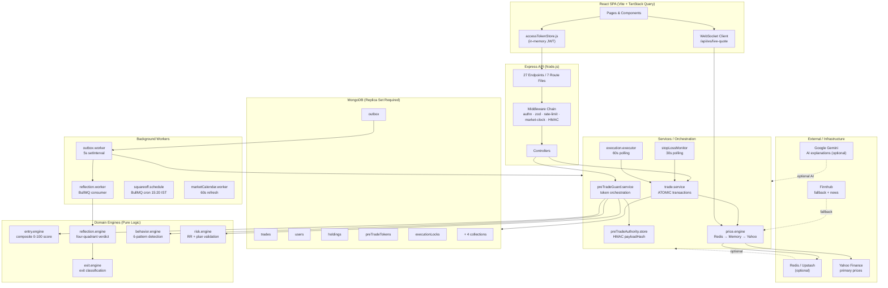

# NOESIS
### Behavior-Aware Paper Trading Platform for Indian Equity Markets

> A full-stack NSE paper trading simulator that treats trader psychology and decision quality as first-class data — not just PnL.

---

## The Problem

Most paper-trading tools record what happened. They track fills, quantities, and profit — but not *why* a trade was allowed, or whether the process was sound when it lost money.

A revenge trade and a disciplined entry look identical in a standard database: same symbol, same price, same quantity. Beginners who review those records cannot separate good process from bad luck, or bad process from good luck — so they keep repeating the same mistakes.

NOESIS solves this by treating every trade as a **decision with a recorded intent**, not just a transaction with a recorded fill. Before any order executes, the trader must plan it. After it closes, an engine classifies the exit against that original plan — producing a verdict that separates process quality from financial outcome.

---

## How It Works

A trader starts by submitting a trade plan: entry price, stop-loss, target, product type, and the thinking behind the trade. NOESIS runs that plan through three scoring engines — setup quality, market consensus, and behavioral history — and returns a composite 0–100 risk score with an ALLOW / CAUTION / BLOCK verdict.

If the trade is allowed, the system issues a short-lived authority token cryptographically bound to the exact plan parameters. The execution endpoint only accepts trades carrying a valid, unmodified token — changing any field after approval causes rejection.

Once a position closes, a background worker asynchronously classifies the exit against the original plan: a stop-loss hit after full hold time becomes `DISCIPLINED_LOSS`; an exit within 10 minutes at a small gain becomes `POOR_PROCESS`. These verdicts feed back into the next pre-trade evaluation, creating a behavioral learning loop.

---

## Architecture



### Key Design Decisions

---

**Integer paise throughout.** All monetary values — balance, prices, stop-loss, target, P&L — are stored and computed as integers in paise (1 INR = 100 paise).
**Why:** Eliminates floating-point rounding errors in trade math. `user.model.js` line 27 comment: "ALWAYS STORED IN PAISE". `holding.model.js` enforces `validator: Number.isInteger` on `avgPricePaise`.
**Tradeoff:** All display formatting (₹ symbol, decimal conversion) is the client's responsibility; the API never returns human-formatted currency strings.

---

**HMAC payload binding.** The pre-trade authority token stores an HMAC-SHA256 hash of the canonical trade payload (`symbol`, `productType`, `pricePaise`, `quantity`, `stopLossPaise`, `targetPricePaise`). At execution, the server recomputes the hash from the incoming request body and rejects any mismatch with `400 PAYLOAD_MISMATCH`.
**Why:** Prevents approval shopping — getting AI sign-off for "Buy 10 shares at ₹500 SL ₹480" and then modifying the request to "Buy 500 shares". Source: `preTradeAuthority.store.js` lines 29–42.
**Tradeoff:** Every canonical field is frozen at evaluation time. Even a legitimate price improvement requires re-running the full pre-trade evaluation.

---

**Transactional outbox for async reflection.** After a SELL executes, the atomic MongoDB transaction writes an `Outbox` document (`status: PENDING`, `type: TRADE_CLOSED`) in the same session as the balance and holding updates. A background poller picks this up and runs reflection asynchronously.
**Why:** Reflection calls Google Gemini and runs multi-step analysis. Doing this inside the HTTP request would add seconds to trade response P99. The outbox guarantees the job is never lost if the process crashes mid-request. Source: `outbox.worker.js`, `reflectionWorker.service.js`.
**Tradeoff:** Reflection results appear seconds after trade close, not instantly. Clients poll `GET /api/trades/execution-status/:tradeId`.

---

**Behavioral veto floor.** If a trader's behavior score falls below 20 (out of 100), the entry engine returns `BLOCK` regardless of how good the setup or market context is.
**Why:** A structurally sound trade plan executed by a demonstrably reckless trader (revenge-trading, overtrading) is still a high-risk execution. This is the core product thesis. Source: `entry.engine.js` line 36 (`behavioralVetoFloor: 20`).
**Tradeoff:** A legitimately good trade can be blocked by behavioral history. This is intentional — the platform prioritizes process learning over execution freedom.

---

**Deterministic engines, AI as overlay.** The ALLOW/BLOCK verdict, exit classification, and reflection quadrant are all computed by pure mathematical functions with no AI calls. Google Gemini is called only for the human-readable *explanation* of a verdict already determined.
**Why:** Determinism makes verdicts testable and reproducible. Every output can be recomputed given the same inputs. Gemini is entirely optional — if `GEMINI_API_KEY` is absent, all explanations return `UNAVAILABLE` and the deterministic verdict still stands.
**Tradeoff:** Scoring weights and thresholds (e.g., `behavioralVetoFloor`, `LOW_RR_THRESHOLD`) are currently hardcoded in `system.config.js`. Calibration requires a code change.

---

**Redis as optional, MongoDB as fallback.** Every Redis-dependent path has an explicit code fallback: auth cache (→ MongoDB), pre-trade token lookup (→ `PreTradeToken.findOne()`), live quote cache (→ in-process `Map` → Yahoo), BullMQ (→ Outbox poller).
**Why:** The Upstash REST client (`infra/redisClient.js` line 38: `supportsBullMQ: false`) cannot support BullMQ's TCP-based protocol. The system must run correctly without persistent Redis.
**Tradeoff:** In-process caches (rate limiters, quote cache) are per-replica. Running multiple API instances creates state divergence — an accepted constraint for this deployment tier.

---

**MongoDB replica set required.** All trade mutations — balance deduction, holding upsert, trade creation, token consumption, outbox insertion — execute inside a single `session.withTransaction()` call.
**Why:** Multi-document atomicity is non-negotiable for financial correctness. A process crash between decrementing balance and creating the trade document would permanently corrupt the ledger. Source: `transaction.js` line 16, with 8-retry logic for `TransientTransactionError` and write-conflict code 112.
**Tradeoff:** Standalone MongoDB fails at `mongoose.startSession()`. Local development requires a replica set.

---

## Tech Stack

| Layer | Technology | Why |
|---|---|---|
| **Frontend** | React 18 + Vite | Fast HMR for development; tree-shakeable production build for the SPA |
| **Server state** | TanStack Query v5 | Stale-while-revalidate per query key; eliminates Redux boilerplate for server data |
| **Backend** | Node.js + Express | Non-blocking I/O suits concurrent WebSocket ticks and polling workers |
| **Database** | MongoDB 7 (replica set) | Multi-document ACID transactions required; document model fits nested trade decision data without joins |
| **Cache** | Redis via Upstash REST | Optional; auth user cache (30s TTL), pre-trade token hot path, live quote shared cache |
| **Validation** | Zod | `strict()` schemas reject unknown fields, preventing mass-assignment; shared between route and controller |
| **Auth** | JWT + HttpOnly cookie + CSRF | Access token in JS memory (never `localStorage`); refresh token cookie not readable by JS; double-submit CSRF on `/refresh` |
| **Market data** | Yahoo Finance (`yahoo-finance2`) | Primary live quote source for execution price; Finnhub is the HTTP fallback |
| **AI** | Google Gemini | Generates human-readable explanations for deterministic verdicts; entirely optional — absent key degrades gracefully |
| **Queue** | BullMQ (when ioredis available) | Reliable cron and job processing for reflection and square-off; falls back to Outbox poller + `setInterval` |
| **Testing** | Jest + `mongodb-memory-server` | Real `withTransaction` semantics in CI via `MongoMemoryReplSet` — no mocking of the transaction layer |
| **CI** | GitHub Actions | 7-step pipeline: setup → MongoDB service → install → syntax check → backend tests → frontend tests → build |

---

## Core Features

### Pre-Trade Intelligence Pipeline

No order can be submitted without completing a pre-trade evaluation. `POST /api/intelligence/pre-trade` accepts the full plan and runs:

1. **Plan capture** — symbol, direction, entry price, stop-loss, target, product type (`DELIVERY`/`INTRADAY`), and trader reasoning are required. The `enforceBuyReview` middleware hard-requires `stopLossPaise` and `targetPricePaise` — a buy order without a stop-loss cannot be submitted at the route level, before reaching the controller.

2. **Three-pillar composite score** — `entry.engine.evaluateEntryDecision()` computes:
   - *Setup score (0–100):* Based on Reward-to-Risk ratio. Below `LOW_RR_THRESHOLD`, penalized by `LOW_RR_PENALTY`.
   - *Market score (0–100):* 95 if aligned with AI consensus, 30 if AVOID, with `adaptiveHighPenalty` (−10) when market risk is flagged HIGH.
   - *Behavior score (0–100):* From `behavior.engine.analyzeBehavior()` over closed-trade history. `REVENGE_TRADING_RISK` caps score at 35; `OVERTRADING_RISK` caps at 40. Intraday trades additionally penalize `FOMO_ENTRY` (−25), `PANIC_EXIT` (−20), and `CHASING_PRICE` (−15).
   - *Composite weights:* Delivery → Setup (40%) + Market (30%) + Behavior (30%). Intraday → Setup (40%) + Market (20%) + Behavior (40%).

3. **Behavioral veto** — If behavior score < 20, verdict is `BLOCK` regardless of composite score.

4. **Authority token issuance** — On ALLOW or CAUTION, `preTradeAuthority.store.js` creates a `PreTradeToken` document in MongoDB with a HMAC-SHA256 `payloadHash` of the canonical fields. Token TTL: 10 minutes (configurable). Token lifecycle: `VALID → IN_USE → CONSUMED`.

### Execution Safety

- **Idempotency** — `ExecutionLock` model: compound unique index on `{ userId, requestId }`. Duplicate requests return the cached response without re-executing. TTL auto-expiry via MongoDB index (`executionLock.model.js` lines 28–32).
- **HMAC payload binding** — At execution, the server re-derives the HMAC over the incoming request body. Any field modification since token issuance returns `400 PAYLOAD_MISMATCH` and aborts before any DB write.
- **Stale price blocking** — `price.engine.js` follows: Redis → in-process `Map` → Yahoo Finance. If all paths return stale data, execution throws `503 MARKET_DATA_UNAVAILABLE` and the transaction is not started. `MAX_CLIENT_PRICE_DRIFT_PCT` (default 0.5%) also blocks if the submitted price deviates too far from the live quote.
- **Atomic transaction scope** — One `session.withTransaction()` covers: balance deduction, `reservedBalancePaise` release, holding upsert (weighted-average price via aggregation pipeline), trade document creation, token state → `CONSUMED`, outbox insertion. All succeed together or all roll back.

### Market Realism

- **IST session enforcement** — `marketHours.service.js` computes current IST time against NSE hours (9:15–15:30). The `checkMarketClock` middleware returns `403 MARKET_CLOSED` outside hours.
- **Holiday calendar** — `MarketCalendar` collection syncs from a Docker service every 24 hours (`marketCalendar.worker.js`). Holidays block execution even within trading hours.
- **Intraday square-off** — BullMQ cron in `squareoff.schedule.js` fires at 15:20 IST on weekdays (Mon–Fri). Falls back to `setInterval` when BullMQ is unavailable. All open intraday positions are auto-closed at the live market price.
- **Stop-loss / target monitoring** — `stopLossMonitor.service.js` polls open holdings every 30 seconds, checks live price against each position's `stopLossPaise` and `targetPricePaise`, and triggers automated sells when thresholds are breached.
- **Delivery vs. intraday isolation** — Holdings tracked separately per `{ userId, symbol, tradeType }`. Intraday and delivery positions in the same symbol are independent, with independent average prices.

### Post-Trade Reflection

After a SELL executes, the outbox event triggers `processTradeClosedEvent()` which runs:

1. **Exit classification** (`exit.engine.js`) — Compares actual exit price and hold duration against the original plan:

| Condition | Exit Type |
|---|---|
| Exit within 10 min, not at stop-loss | `PANIC` |
| Exit price ≤ stop-loss | `STOP_LOSS_HIT` |
| Exit price > target price | `LATE_EXIT` |
| Exit price between entry and target | `EARLY_EXIT` |
| Exit price between stop-loss and entry | `EARLY_CUT` |

2. **Reflection verdict** (`reflection.engine.js`) — Maps exit classification to a psychological outcome:

| Exit Classification | Verdict |
|---|---|
| `STOPPED_OUT` | `DISCIPLINED_LOSS` |
| `TARGET_HIT` | `DISCIPLINED_PROFIT` |
| `PANIC` | `POOR_PROCESS` |
| `EARLY_PROFIT_TAKE` | `POOR_PROCESS` |
| `OVERHOLD` | `LUCKY_PROFIT` |
| `EARLY_CUT` | `DISCIPLINED_LOSS` |

3. **AI explanation** — `aiExplanation.service.js` calls Gemini for a human-readable learning summary. The verdict is already determined; the explanation is supplementary and fails gracefully.

4. **Trade finalized** — Status transitions `EXECUTED_PENDING_REFLECTION → COMPLETE`. `User.systemStateVersion` increments to signal clients that data has changed.

### Behavioral Analytics

- **6 patterns detected** by `behavior.engine.js`: `REVENGE_TRADING`, `OVERTRADING`, `HOLDING_LOSERS`, `LOSS_CHASING`, `FOMO_ENTRY`, `CHASING_PRICE`. Each has a configurable detection window and confidence threshold sourced from `SYSTEM_CONFIG`.
- **Discipline score** — `100 − Σ(pattern.confidence / 2)` across all detected patterns.
- **Real-time pre-trade signals** — `behaviorSignals.service.js` queries the last 20 trades *before* a new entry to catch behavioral risk that hasn't yet produced a closed trade (e.g., revenge risk within minutes of a loss). This is the circuit breaker for the most time-sensitive patterns.
- **Skill progression** — `progression.engine.js` compares last-20 vs. prior-20 closed trades for discipline trend direction, surfaced via `GET /api/metrics/skill-progress`.

### Background Workers

| Worker | File | Function | Trigger |
|---|---|---|---|
| Outbox Poller | `workers/outbox.worker.js` | Dequeues `PENDING` outbox jobs; dispatches to reflection and analytics handlers | Every 5 seconds (`setInterval`) |
| Reflection Worker | `queue/workers/reflection.worker.js` | BullMQ consumer for `TRADE_CLOSED` events; calls `processTradeClosedEvent()` | Triggered by outbox dispatch |
| Stop-Loss Monitor | `services/stopLossMonitor.service.js` | Polls open holdings; auto-sells on SL/TP breach via `trade.service` | Every 30 seconds |
| Square-Off Scheduler | `queue/squareoff.schedule.js` | Force-closes all open intraday positions at 15:20 IST | BullMQ cron `20 15 * * 1-5`; interval fallback |
| Execution Executor | `services/execution.executor.js` | Picks up `PENDING_EXECUTION` trades and calls `executeOrder()` | Every 60 seconds |
| Order Sweeper | `services/order.sweeper.js` | Marks expired pending orders `FAILED`; releases reserved balance | Periodic |

---

## Complete Trade Lifecycle

The full sequence from first thought to final journal entry:

1. **Register / Login** — `POST /api/auth/register` → `POST /api/auth/login`. Returns a short-lived access JWT (15 min, stored in JS memory via `accessTokenStore.js`, never `localStorage`) and a long-lived refresh token (7 days, `HttpOnly` cookie). Rate limited to 10 requests / 15 minutes per IP.

2. **Check market conditions** — `GET /api/market/session` confirms NSE is open. `GET /api/market/quote?symbol=RELIANCE.NS` fetches live price (Yahoo Finance primary, Finnhub fallback). `GET /api/intelligence/pre-trade-news` returns AI-analyzed signals for the symbol.

3. **Request pre-trade evaluation** — `POST /api/intelligence/pre-trade` with full plan. `intelligenceLimiter` enforces 30 requests/minute per IP. `preTradeGuard.service` orchestrates: `risk.engine` validates plan → `behaviorSignals.service` checks live patterns → `behavior.engine` scores historical trades → `entry.engine` computes composite verdict → `preTradeAuthority.store` issues authority token with HMAC `payloadHash`. Token valid for 10 minutes.

4. **Submit buy order** — `POST /api/trades/buy` with `Idempotency-Key` header and `pre-trade-token` header. Middleware chain runs in order:
   - `protect` — JWT verified; user loaded from Redis cache (30s TTL) or MongoDB fallback
   - `tradeLimiter` — 5 requests / 10 seconds per *user ID*, Redis-backed
   - `enforceRequestId` — idempotency lock acquired in `ExecutionLock`
   - `validateTradePayload` — Zod strict schema; unknown fields rejected
   - `enforceBuyReview` — `stopLossPaise` and `targetPricePaise` required at route level
   - `checkMarketClock` — IST hours and holiday calendar checked

5. **Atomic execution opens** — `mongoose.startSession().withTransaction()` begins. Inside the transaction:
   - `PreTradeToken` fetched; verified as `VALID`
   - HMAC recomputed from request body; compared to stored `payloadHash` — mismatch aborts
   - Live price fetched via `price.engine.js` (Redis → memory → Yahoo)
   - Client price drift checked against live price (max 0.5% deviation)
   - System invariants validated
   - User balance decremented; `reservedBalancePaise` released
   - `Holding` upserted with weighted-average price update
   - `Trade` document created with status `EXECUTED`
   - `PreTradeToken` state set to `CONSUMED`
   - `Outbox` record inserted (`type: TRADE_CLOSED` for SELL, nothing for BUY)
   - All writes committed atomically.

6. **Client polls async status** — `GET /api/trades/execution-status/:tradeId` until status leaves `PENDING_EXECUTION` or `PROCESSING`.

7. **Position monitored automatically** — `stopLossMonitor.service.js` checks the holding every 30 seconds against live prices. If price hits `stopLossPaise`, an automated sell is triggered through the full `trade.service` path. If `INTRADAY`, the square-off cron fires at 15:20 IST.

8. **Manual sell** — Follows the same pre-trade evaluation and execution middleware chain as BUY. On execution success, trade status becomes `EXECUTED_PENDING_REFLECTION` and an `Outbox` record (`TRADE_CLOSED`) is inserted in the same transaction.

9. **Async reflection** — `outbox.worker.js` dequeues the event within 5 seconds (or BullMQ `reflection.worker.js` if Redis is available). `processTradeClosedEvent()` runs:
   - `exit.engine` classifies the exit type and deviation score
   - `reflection.engine` assigns the four-quadrant psychological verdict
   - Gemini generates a human-readable learning summary (optional)
   - Trade status transitions → `COMPLETE`; `reflectionStatus` → `DONE`
   - `User.systemStateVersion` increments

10. **Journal and analytics** — `GET /api/journal/summary` returns closed trades with reflection verdicts. `GET /api/metrics/behavior` returns current behavioral pattern analysis. `GET /api/analysis/summary` returns the analytics snapshot. The behavioral data from this trade feeds into the *next* pre-trade evaluation's behavior score.

---

## Security

| Concern | Implementation |
|---|---|
| **Access token storage** | JS module-level variable in `accessTokenStore.js`; never `localStorage`; cleared on full page reload |
| **Refresh token** | `HttpOnly` cookie — not readable by JavaScript; protected from XSS token theft |
| **CSRF protection** | Double-submit cookie pattern on `/refresh`; `X-CSRF-Token` header required; `SKIP_CSRF_DEV=true` blocked by `verify-env.js` in production with `process.exit(1)` |
| **HMAC payload integrity** | SHA-256 HMAC over canonical payload fields in `preTradeAuthority.store.js`; mismatch → `400 PAYLOAD_MISMATCH` before any DB write |
| **Idempotency replay** | `ExecutionLock` compound unique index `{ userId, requestId }`; replays return cached response, never re-execute |
| **NoSQL injection** | `express-mongo-sanitize` strips `$` and `.` from all request bodies globally (`app.js` line 14) |
| **Security headers** | `helmet()` applied globally: HSTS, XSS protection, no-sniff, frameguard, content security policy |
| **CORS** | Explicit origin allowlist from `FRONTEND_URL` / `FRONTEND_URLS` env vars; warns if non-HTTPS origin detected in production |
| **Rate limiting** | 5 limiters: `authLimiter` (IP, 10/15m), `refreshLimiter` (IP, 60/15m), `intelligenceLimiter` (IP, 30/min), `tradeLimiter` (user ID, 5/10s, Redis-backed), `marketReadLimiter` (IP, 60/min) |
| **Password storage** | `bcryptjs` with salt factor 10 via Mongoose `pre("save")` hook; raw password never stored |
| **Refresh token at rest** | SHA-256 hash of the raw token stored in MongoDB; raw token never persisted; cannot be replayed from a DB dump |

---

## Testing

**206 total test cases** across **51 test files** (49 backend suites via Jest, 2 frontend suites via Vitest). All pass. All are wired into the CI pipeline — no floating test files.

| Category | Location | What it covers |
|---|---|---|
| **Unit** | `backend/tests/unit/` | Isolated pure functions: risk math, market-hours timezone logic, composite score weights, exit classification |
| **Integration** | `backend/tests/integration/` | End-to-end buy/sell flows with real MongoDB transactions, stale price blocking, HMAC tamper detection, full audit sequence (`system.audit.test.js`) |
| **Security** | `backend/tests/security/` | Rejected JWT signatures, expired tokens, CSRF barriers, token replay prevention |
| **Concurrency** | `backend/tests/concurrency/` | Overlapping reflection payloads to verify exactly-once journaling under race conditions |

**MongoDB transaction testing:** Integration tests use `MongoMemoryReplSet` from `mongodb-memory-server`, which initializes a real in-process MongoDB replica set. `withTransaction` semantics run against actual replica-set machinery — the transaction layer is not mocked.

**CI pipeline** (`.github/workflows/ci.yml`, 7 steps): Node.js 20 setup → MongoDB service container → `npm ci` → backend syntax check → `npm test` (Jest, `--runInBand`) → `npm run test:unit` (Vitest) → production `build`.

**Coverage gaps (honest):**
- No Playwright or Cypress E2E tests. The pre-trade token handoff from evaluation to execution, which is the most critical client-side flow, is not browser-tested.
- No multi-instance concurrency tests. The `stopLossMonitor` race condition across two API replicas against the same MongoDB cluster is not simulated.
- Yahoo Finance and Finnhub responses are stubbed in all tests. Live schema drift from upstream providers would not be caught by CI.

---

## Known Limitations

1. **MongoDB replica set required for local development** — `mongoose.startSession()` throws on a standalone instance; developers must run `mongod --replSet rs0` or use Docker Compose with replica set initialization. (`backend/src/utils/transaction.js` line 16)

2. **In-process workers cannot scale horizontally** — The outbox poller, stop-loss monitor, and execution executor run as `setInterval` loops inside the single Express process. Deploying two API replicas causes duplicate polling and potential double-execution. (`server.js` lines 20–22 document this explicitly as a known constraint.)

3. **BullMQ is inactive on Upstash REST Redis** — The Upstash REST client facade sets `supportsBullMQ: false` (`infra/redisClient.js` line 38). BullMQ reflection and square-off workers only activate when a separate raw `ioredis` TCP connection is provided. The current `render.yaml` does not wire one.

4. **Reflection worker does not guard against incorrect event types** — `processTradeClosedEvent()` checks `reflectionStatus` for `DONE`/`FAILED` but does not verify that the trade `type` is `SELL` or `status` is `EXECUTED_PENDING_REFLECTION`. A misrouted `TRADE_CLOSED` event for a BUY trade would corrupt the trade document by transitioning it to `COMPLETE`. (`reflectionWorker.service.js` lines 24–28)

5. **Intelligence and market rate limiters use in-process `MemoryStore`** — `intelligenceLimiter` and `marketReadLimiter` are not Redis-backed. Their limits apply per-replica, not per-cluster. Under load balancing, a user can exceed the intended global rate limit by routing requests across replicas. (`middlewares/rateLimiter.js`)

6. **Two independent price-fetching paths can diverge** — `price.engine.js` (used by trade execution and WebSocket) and `marketData/live.provider.js` (used by `GET /api/market/quote`) both ultimately call Yahoo Finance but through different cache layers. The displayed quote and the execution price can differ at the same instant.

---

## What I Would Do Next

1. **Fix the reflection worker guard (one-line, high correctness impact).** Add `if (trade.type !== "SELL" || trade.status !== "EXECUTED_PENDING_REFLECTION") return;` at the top of `processTradeClosedEvent()`. This prevents status corruption on any misrouted outbox event with no behavioral change to the happy path.

2. **Separate background workers into a dedicated process.** Move the outbox poller, stop-loss monitor, and execution executor into a standalone Node process (or a dedicated BullMQ worker service in `render.yaml`). This removes the single-instance constraint entirely, makes horizontal API scaling safe, and eliminates the duplicate-polling risk without any change to the core business logic.

3. **Unify the two price-fetching paths.** Refactor `marketData/live.provider.js` to route all quote requests through `price.engine.js`'s `getLivePrice()`. This ensures the price shown on the dashboard and the price used for execution come from the same cache layer, eliminating the divergence a user would notice as slippage.

---

## Getting Started

### Prerequisites

- Node.js 20+
- MongoDB 7 running as a **replica set** — standalone MongoDB will fail at `mongoose.startSession()`
- (Optional) An Upstash Redis account or local Redis instance for caching and BullMQ

### Required Environment Variables

```bash
MONGO_URI=mongodb://localhost:27017/noesis?replicaSet=rs0
JWT_SECRET=<at-least-32-character-random-string>
FRONTEND_URL=http://localhost:5173
```

See `.env.example` in the repository root for all optional variables: Gemini API key, Finnhub key, rate-limit overrides, BullMQ Redis URL, token TTLs, and price drift thresholds.

### Install and Run

```bash
# Clone
git clone https://github.com/<your-username>/noesis.git
cd noesis

# Backend
cd backend
npm install
npm run dev          # Express on port 5000 (or PORT env var)

# Frontend (separate terminal)
cd ../frontend
npm install
npm run dev          # Vite dev server on port 5173
```

### Run Tests

```bash
# Backend — all 206 test cases
cd backend
npm test

# Frontend — 4 unit tests
cd frontend
npm run test:unit
```

---

## Project Structure

```
noesis/
├── backend/
│   └── src/
│       ├── app.js                  # Express app factory; global middleware stack
│       ├── server.js               # Process entry point; worker startup; health probes
│       ├── routes/                 # 7 route files, 27 endpoints
│       ├── controllers/            # HTTP ↔ service boundary; no business logic
│       ├── engines/                # Pure logic: entry, exit, reflection, journal, learning, market intelligence
│       ├── services/               # Orchestration + I/O: trade, market data, price, behavior, risk, SL monitor
│       │   └── intelligence/       # preTradeGuard.service, preTradeAuthority.store
│       ├── workers/                # setInterval jobs: outbox poller, calendar sync, analytics
│       ├── queue/                  # BullMQ queue definition + reflection/squareoff workers
│       │   └── workers/
│       ├── models/                 # 10 Mongoose models (Trade, User, Holding, PreTradeToken, ...)
│       ├── middlewares/            # auth, rateLimiter, validateData, validateTradePayload, error, tracing
│       ├── infra/                  # redisClient (Upstash facade), liveQuoteWs, runtimeState
│       ├── domain/                 # DTOs, FIFO P&L mapping, trade contract normalizers
│       ├── adapters/               # Outbound shape translation for API responses
│       ├── context/                # AsyncLocalStorage for traceId propagation through workers
│       ├── config/                 # db.js, system.config.js (weights, thresholds, limits)
│       └── utils/                  # transaction.js (8-retry wrapper), Winston logger, validators
│
├── frontend/
│   └── src/
│       ├── v2/
│       │   ├── api/                # Axios clients with auth interceptors; TanStack Query hooks
│       │   ├── components/         # Shared UI components
│       │   └── pages/              # Route-level views
│       └── features/
│           └── auth/               # AuthContext, accessTokenStore.js
│
├── .github/
│   └── workflows/
│       └── ci.yml                  # 7-step CI pipeline
│
└── render.yaml                     # Single web-service deployment config
```

---

## License

MIT
